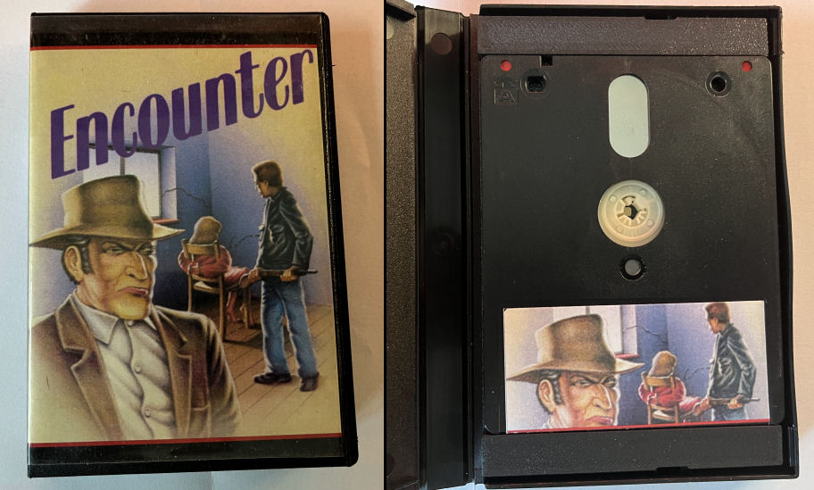
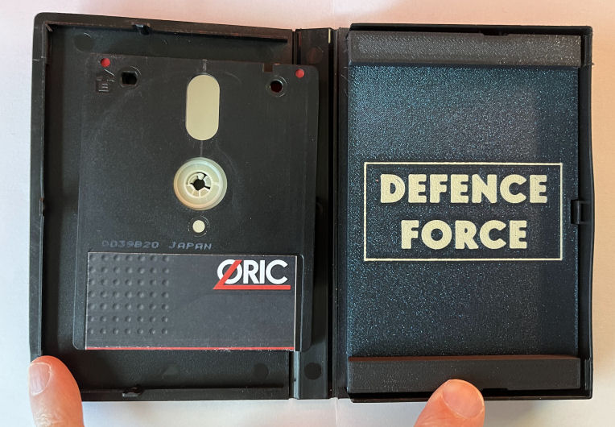
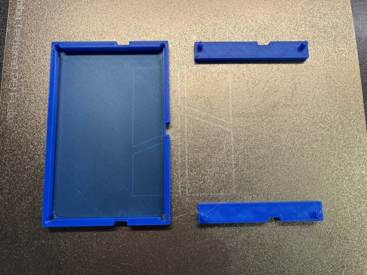
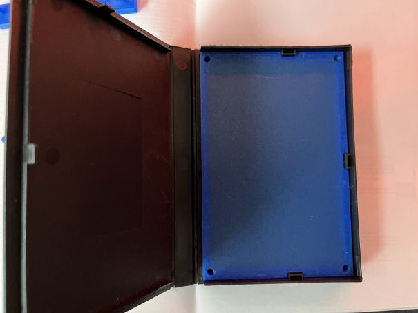
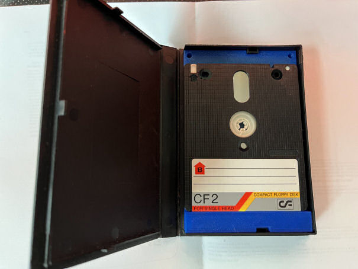
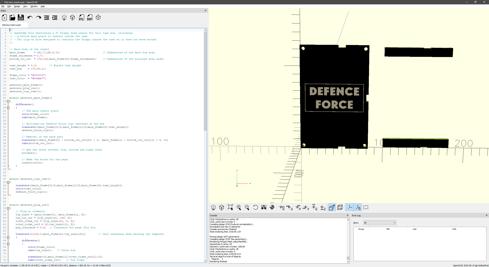
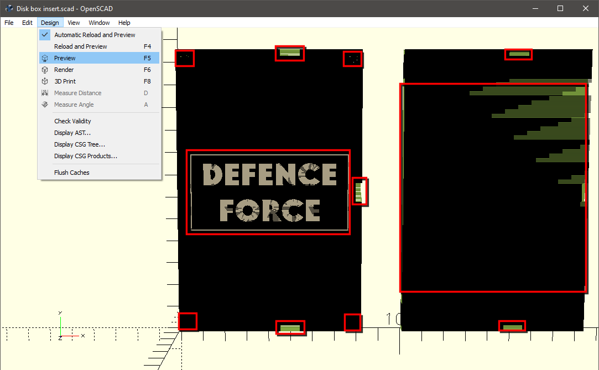
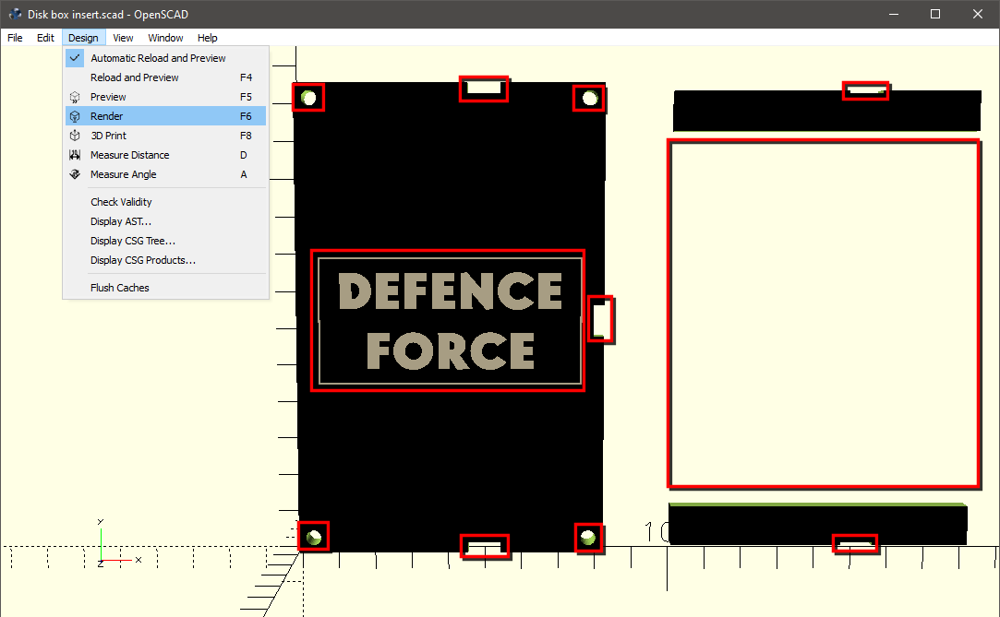
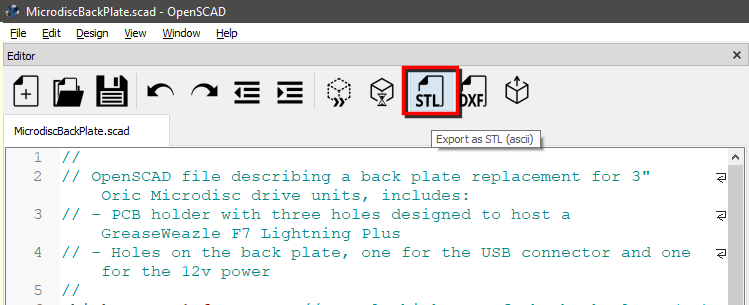
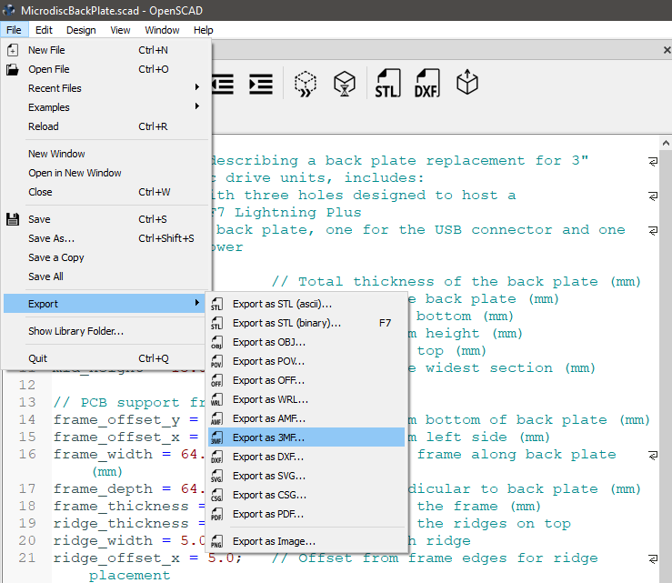

**Oric Floppy Box Insert**

3D printable "Insert" to transform a tape storage box into a 3" storage box

- [This project](#this-project)
- [OpenSCAD](#openscad)
  - [Render vs Preview](#render-vs-preview)
  - [Export: STL vs 3MF](#export-stl-vs-3mf)
- [Printing the object](#printing-the-object)
- [Modifying the object](#modifying-the-object)

# This project

So here is what this project is all about, adapting tape cases so they work well with 3" floppies.

I think it looks quite nice like using proper colors, inlays and labels:

To get there you basically print three items...

...you put the base plate in the case...

...and finally with the two retainers in place to block the floppy from moving

# OpenSCAD

You will find the .STL and .3MF files in the repository, but the source file is in OpenSCAD format.

OpenSCAD is a free software that allows to model objects by giving instructions like "move to this position and add a cube here that you will resize to this specific dimensions and then subtract another scaled cube from the first one to make a hole inside".

This type of system is probably not going to cut it for complex organic shapes, but for things you can mentally split in simple primitives to add or subtract to each other it's quite easy to use.

You can find OpenSCAD on <https://openscad.org> but unfortunately the last official release (as of today) is from January 2021 so I would recommend using one of the [Nightly Builds](https://openscad.org/downloads.html#snapshots) which have quite a few features that are unfortunately not present in the official builds!

For what's worth, I've been using "version 2025.08.19 (git 6afea6fca)" without any problem.

OpenSCAD has its own built-in editor, but it does not have support for revision control, so you can use VSCode instead with one of the plugins that allow syntax coloring and previewing directly from inside VS Code (like for example https://github.com/Antyos/vscode-openscad)

The idea is simply to load the script in OpenSCAD and you should normally see something like that:

## Render vs Preview

When you edit the script and save, the view will refresh in Preview mode.

Preview works fine for most of the high level geometry, but it does not deal very well with things that are coplanar, so for example in this object the holes will appear flickering or sometimes even not visible:

The Render mode on the other hand takes a lot longer to refresh because it performs proper geometry calculations to properly remove hidden elements, which will look like that:

This is quite important to remember, because when you want to export the object to STL to 3MF format you will have to perform a render first.

## Export: STL vs 3MF

.scad files are OpenSCAD script format, this format is not supported by most software, so you will need to export to something your printer slicer/tools of choice understand, which in most cases will be either .STL (stands for either "STereoLithography", "Standard Triangle Language" or "Standard Tessellation Language" depending of where you get the information from!) or .3MF ("3D Manufacturing Format") for the specific purpose of 3D printing.

This backplate will export just fine to .STL because it has only one material, so just go for it.

Exporting to .3MF would be mostly useful if you wanted to have multiple colors/materials, like if for example you wished to have things like the "12 volts" label actually printed out as a different color text on the plate.

If you want to export to STL, just make sure to press F6 to update the render, and then click on the STL button in the toolbar.

If you want to export to other format, then you need to go to the menu and select File -> Export

To make your life easier you'll find the [.3MF](DiskBoxInsert.3mf) file already exported alongside the [.SCAD](DiskBoxInsert.scad) one, there's also the [.STL](DiskBoxInsert.stl) version if you don't care/need about the logo.

# Printing the object

You can just load/import the STL file and print it in any color you want.

You should make sure to have the back plate at the bottom of the print area so you get a nice and flat surface without any glitches - this is specially important for the text quality.

# Modifying the object

You may not want to have the "Defence force" logo, or the frame around it, you can easily change that in the script by changing the **"show_text"** to be 0 instead of 1.

If you want to change the colors, you can edit **"frame_color"** and **"text_color"**.

If you want to change the text, you need to edit it in the **"framed_text()"** module.
